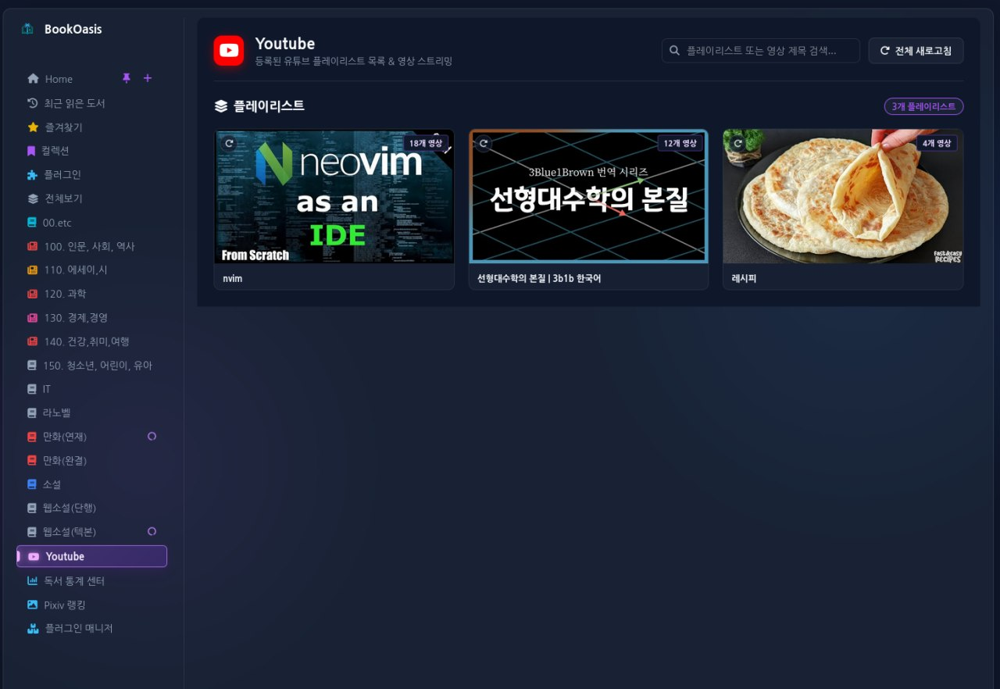
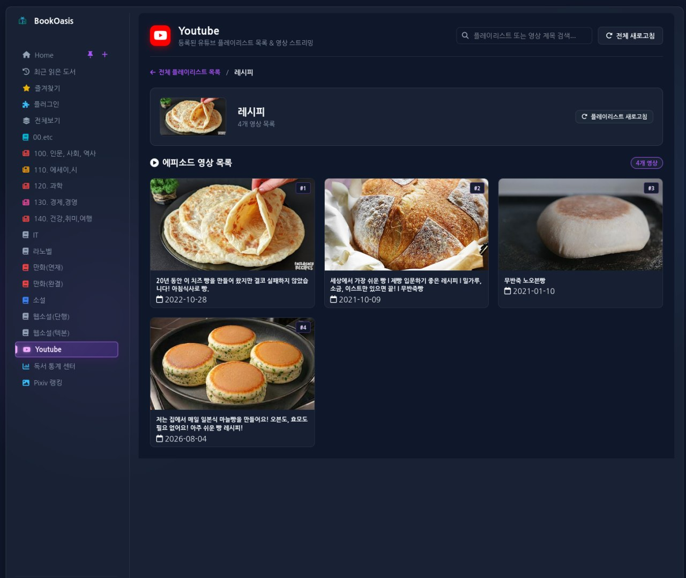
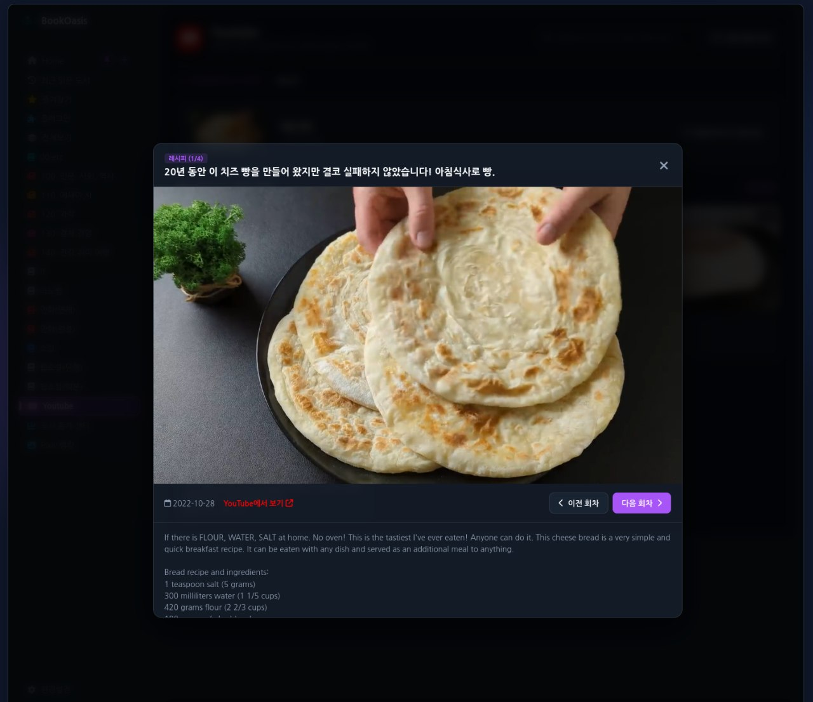
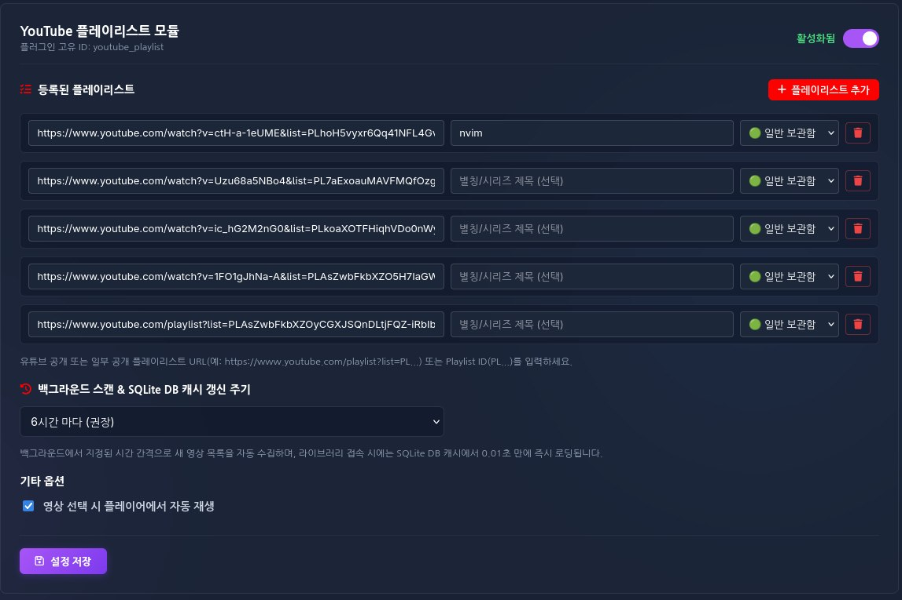

# 🎥 [BookOasis](https://github.com/leeyj/BookOasis_stable) YouTube Playlist Metadata & Category Plugin

[BookOasis](https://github.com/leeyj/BookOasis_stable) 미디어 서버에서 유튜브 **공개 및 일부 공개(Unlisted) 플레이리스트**를 등록하여 라이브러리의 `Youtube` 카테고리 메뉴에서 YouTube 영상 스트리밍을 제공하는 **1등 시민(First-class Citizen) 카테고리 레벨 플러그인**입니다.

## 📌 v1.0.11 — BookOasis v2.5.x 호환성 정리

- `window.BookOasisPlugin.getSession()` 및 `bookoasis:session-change` 공식 계약 사용
- `window.currentLibraryType`, `window.state`, 코어 DOM selector 등 내부 구현 의존 제거
- Youtube 카테고리 노출 세션을 `general` / `adult`로 명확히 제한
- `window.BookOasisPlugin.getCachedImageUrl()`로 플레이리스트/영상 썸네일 로컬 WebP 캐시 지원
- `AUTO_PLAY` 설정을 YouTube IFrame 플레이어의 실제 재생 방식에 반영
- `get_dashboard_data()`의 `limit` 준수 및 공통 `items` 계약 지원 (`series` 하위 호환 유지)
- 빈 설정 화면에서 샘플 플레이리스트가 실제 설정값으로 저장될 수 있던 문제 수정
- BookOasis 메인 검색창 DOM hook 및 내부 i18n 전역 의존 제거
- 표준 `unittest` 기반 플러그인 계약 회귀 테스트 추가

> BookOasis 코어 소스/문서 수정 없이 공개 플러그인 API 계약만 사용합니다.

---

## ⚙️ 설정 및 사용 방법 (Setup & User Guide)

### 1. 플러그인 활성화
- 관리자 계정으로 로그인 후 **[환경설정 ⚙️] → [플러그인 설정]** 탭으로 이동
- `Youtube Playlist` 토글 **ON**

### 2. 플레이리스트 등록 및 일괄 등록 (Bulk Import)
- **개별 추가**: **`[+ 플레이리스트 추가]`** 버튼 클릭 후 URL/ID 입력
- **일괄 등록**: **`[📥 일괄 등록]`** 버튼 클릭 후 1줄에 1개씩 붙여넣기  
  (입력 형식 예시: `https://www.youtube.com/playlist?list=PL123 | 파이썬 강좌 | general`)
  - **별칭 생략 가능**: 생략 시 유튜브 원본 제목 자동 적용
  - **보관함 생략 가능**: 생략 시 `🟢 일반 보관함` 기본 지정
- **보관함 분류**: `🟢 일반 보관함` / `🔞 성인 보관함` 선택
- **백그라운드 스캔 주기**: 1h / 3h / **6h(권장)** / 12h / 24h / 수동만
- **[설정 저장]** 클릭

### 3. Youtube 카테고리 시청 및 검색
- 좌측 사이드바 **`Youtube`** 카테고리 클릭 → SQLite DB에서 **0.01초 만에 최속 로딩**
- **플러그인 검색**: Youtube 화면의 전용 검색창에 키워드 입력
  *(별칭, 유튜브 원본 제목, 개별 에피소드 영상 제목까지 실시간 다중 매칭)*
- **개별 플레이리스트 새로고침**: 카드 우상단 **🔄 버튼** 또는 상세 화면 배너의 **`[플레이리스트 새로고침]`** 버튼 클릭

---

## 📁 디렉토리 구조 (Directory Structure)

```text
plugins/metadata/youtube_playlist/
  ├── __init__.py                    # Python 모듈 패키지 (YouTubePlaylistMetadataProvider export)
  ├── youtube_playlist.py            # 메인 파이썬 모듈 (Dual-DB Sync, SQLite WAL 캐시, Web/RSS Hybrid 파서)
  ├── youtube_playlist_cache.db      # SQLite 로컬 캐시 DB (자동 생성, .gitignore 처리)
  ├── VERSION                        # 버전 관리 파일: {"plugin version": "1.0.11"}
  ├── index.html                     # 라이브러리 Youtube 카테고리 풀페이지 HTML (i18n 지원)
  ├── style.css                      # 풀페이지 CSS (16:9 썸네일, Sticky/Modal 플레이어, 테마 연동)
  ├── script.js                      # 풀페이지 JS (다중 필드 검색, 개별 새로고침, 듀얼 플레이어, i18n)
  ├── settings.html                  # 환경설정 탭 커스텀 폼 HTML (5개 고정 스크롤, 검색, 일괄 등록)
  ├── settings.css                   # 환경설정 탭 미세 스타일 및 전용 스크롤바
  ├── settings.js                    # 환경설정 탭 동적 행 관리, 자동 타이틀 힌트, 일괄 파서
  ├── tests/test_youtube_playlist.py # BookOasis 플러그인 계약 회귀 테스트
  ├── screenshots/                   # 스크린샷 이미지 디렉토리
  ├── LICENSE                        # GNU AGPL-3.0 라이선스 문서
  └── README.md                      # 이 문서
```

---

## 📸 스크린샷 (Screenshots)

### 1. Youtube 플레이리스트 목록 (Playlist List View)


### 2. 에피소드 영상 목록 (Video Grid View)


### 3. YouTube 임베디드 플레이어 (Embedded YouTube Player)


### 4. 관리자 설정 (컴팩트 스크롤 & 일괄 등록 & 실시간 필터)


---

## 🌟 핵심 기능 (Key Features)

### 1. 🌐 i18n 국제화 / 다국어 지원 (Korean & English Support)
- **한국어(ko) 및 영어(en)** 완전 전면 지원
- 브라우저 표준 언어 정보 (`document.documentElement.lang`, `navigator.language`)만 사용해 코어 내부 전역에 의존하지 않음
- 영어(`en`) 기본 폴백(Fallback) 지원으로 글로벌 사용 환경 호환

### 2. 🔍 4중 다중 필드 통합 검색 (Multi-field Integrated Search)
- 라이브러리 메인 및 설정창 검색 시 아래 4개 필드 실시간 다중 매칭:
  1) **지정한 별칭** (`custom_name`)
  2) **현재 표출 제목** (`title`)
  3) **유튜브 원본 제목** (`original_title`)
  4) **수집된 개별 에피소드 영상 제목 및 설명** (`video.title` / `video.description`)
- BookOasis 코어 DOM에는 직접 의존하지 않고 플러그인 전용 검색창에서 독립적으로 동작

### 3. ⚙️ 컴팩트 5개 고정 스크롤 & 일괄 등록 (Compact Settings UI & Smart Bulk Import)
- **5개 아이템 고정 높이 스크롤바** (`max-height: 220px`): 항목이 20+개 이상 늘어나도 설정 페이지 길이 유지
- **스마트 일괄 등록 (Bulk Import)**: `URL/ID | 별칭(선택) | 일반/성인(선택)` 1줄에 1개씩 붙여넣어 1초 만에 20개 이상 일괄 추가
- **등록 개수 카운터 뱃지 및 순번** (`#1`, `#2`...) 표출
- **설정 전용 실시간 검색 필터** 구비

### 4. 🏷️ 별칭 생략/삭제 시 자동 타이틀 폴백 (Auto Title Fallback)
- 별칭을 따로 입력하지 않거나 기존 별칭을 삭제하면, 유튜브에서 수집된 **원본 플레이리스트 제목이 100% 자동 적용**
- 설정 입력창 힌트(placeholder)에 원본 플레이리스트 제목이 실시간 가시적 안내

### 5. 100+개 영상 파싱 (Web/RSS Hybrid Parser)
- **별도 API 키 불필요** — 유튜브 공개 및 일부 공개(Unlisted) 플레이리스트 URL/ID 입력만으로 즉시 구동
- HTML `ytInitialData` JSON 딥 트리 탐색 + RSS 피드 결합으로 100개 이상의 모든 영상에 **100% 실제 제목과 메타데이터 매핑**

### 6. 일반 / 성인 보관함 엄격 구분 & 양방향 자동 동기화 (Dual-DB Sync)
- 각 플레이리스트를 `🟢 일반 보관함` / `🔞 성인 보관함`으로 개별 분류 등록
- 일반 서재 접속 시 일반 지정 플레이리스트만, 성인 서재 접속 시 성인 지정 플레이리스트만 **엄격 분리 노출**
- `general.db` ↔ `adult.db` 간 **마스터 설정 실시간 100% 양방향 동기화**

### 7. SQLite DB 기반 백그라운드 스케줄러 & 초고속 캐시 (SQLite Cache)
- 설정된 스캔 주기(기본 6시간)마다 자동 수집 → **SQLite DB (`youtube_playlist_cache.db`)에 WAL 모드로 캐싱**
- 카테고리 진입 시 외부 네트워크 대기 없이 **SQLite DB에서 0.01초 만에 즉시 반환**

### 8. 다음 회차 자동 재생 & 모바일 상단 고정 플레이어 (Autoplay & Mobile Sticky Player)
- YouTube IFrame API `postMessage` 이벤트 감지 (`ENDED`) → 다음 영상 자동 연결
- 스마트폰/모바일 환경(**≤768px**)에서는 상단 고정 인라인 플레이어, 데스크톱(>768px)에서는 중앙 모달 플레이어 제공

---

## 📄 라이선스 (License)

이 프로젝트는 [BookOasis](https://github.com/leeyj/BookOasis_stable) 상위 프로젝트와 동일한 **[GNU Affero General Public License v3.0 (AGPL-3.0)](LICENSE)** 라이선스 하에 배포됩니다.  
자세한 계약 및 조건은 [LICENSE](LICENSE) 파일을 참조하세요.
